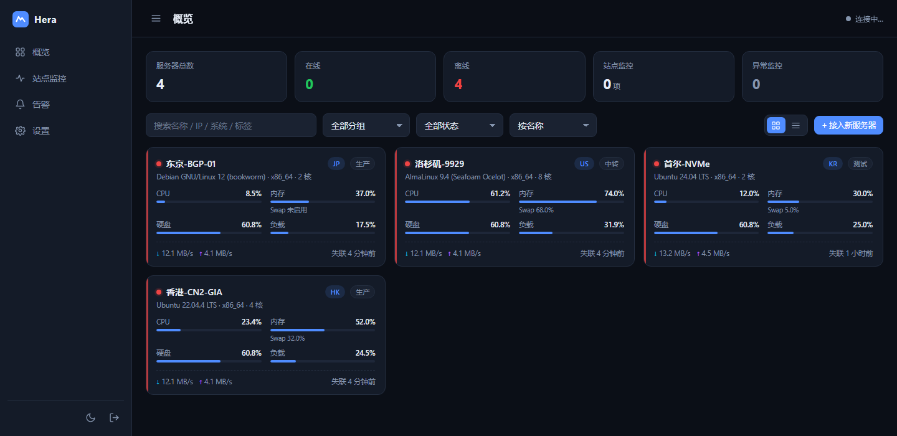
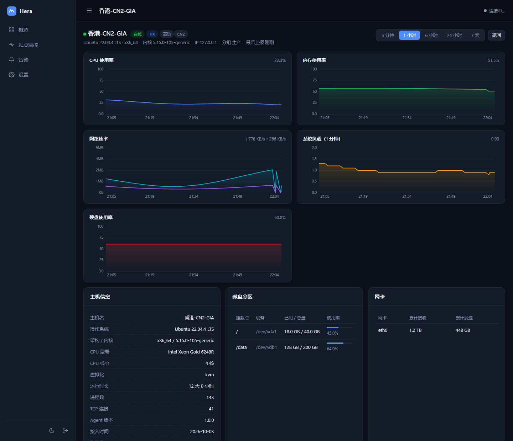
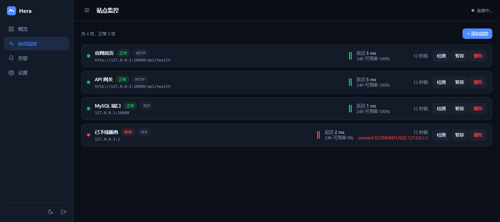
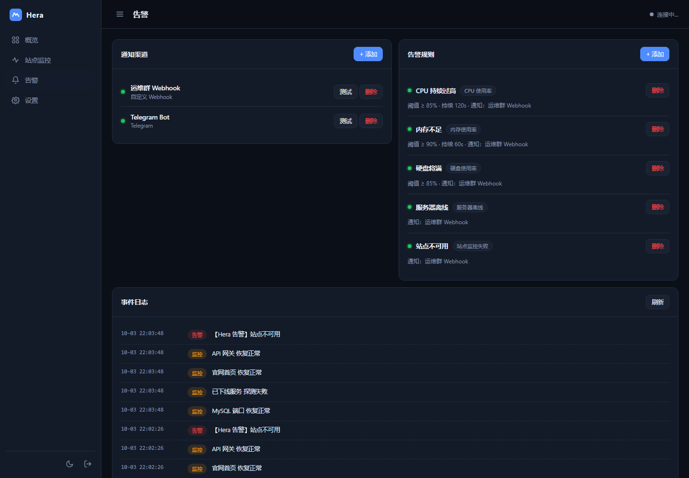

# Hera Monitor

轻量、零依赖、一键部署的服务器监控面板 —— 类似[哪吒监控](https://github.com/nezhahq/nezha)，但部署与接入都只需要**一条命令**。

> **Server 端零 npm 依赖**（只用 Node 内置模块），**Agent 是纯 bash 脚本**（只依赖 `/proc` 和 `curl`）。

```
┌──────────────┐    HTTP/JSON 上报     ┌─────────────────────────┐
│  被监控服务器  │ ───────────────────▶ │   Hera 服务端 (Node.js)  │
│  hera-agent  │                       │  ┌───────────────────┐  │
│  (纯 bash)   │ ◀─────── 下发间隔 ──── │  │ 面板 / SSE / 告警  │  │
└──────────────┘                       │  └───────────────────┘  │
                                       └────────────┬────────────┘
                                                    │ 浏览器实时推送
                                                ┌───▼────┐
                                                │ 监控面板 │
                                                └────────┘
```

---

## 📸 界面预览

**概览** —— 卡片式实时状态，CPU / 内存 / 硬盘 / 负载 / 网速一屏看完



**服务器详情** —— Canvas 手绘历史曲线，5 分钟到 7 天自由切换



**站点监控** —— HTTP / TCP 探针，延迟、可用率、最近 60 次探测热力条



**告警** —— 多渠道推送 + 规则配置 + 事件日志



---

## ✨ 特性

| 能力 | 说明 |
|---|---|
| 🖥 **实时监控** | CPU / 内存 / 交换分区 / 磁盘 / 网络速率 / 负载 / 进程数 / TCP 连接 / 在线时长，SSE 秒级推送 |
| 📈 **历史曲线** | 5 分钟 / 1 小时 / 6 小时 / 24 小时 / 7 天，服务端自动降采样；Canvas 手绘图表，无 CDN 依赖 |
| 🌐 **站点监控** | HTTP(S) / TCP 探针，状态码与关键字校验、延迟统计、24 小时可用率、最近 60 次探测热力条 |
| 🔔 **多渠道告警** | Webhook / Telegram / 钉钉 / 飞书 / Bark / Server 酱 / Gotify；支持阈值、持续时长、指定服务器、冷却时间 |
| 🏷 **服务器管理** | 分组、标签、地区、备注、价格、到期日、自定义排序 |
| 🔒 **安全** | 随机初始密码、HMAC 签名会话、登录限流、路径穿越防护、Agent 密钥可轮换、时序数据裁剪 |
| 📦 **一键部署** | `docker compose up -d` 即可跑起来；另有 `install.sh` 自动装 Node + 注册 systemd。提供多架构镜像与容器排障脚本 |
| 🔍 **可排障** | 启动时自检并打印实际监听地址 / 数据目录可写性 / 静态资源状态；异常请求必定返回响应而不会挂死 |
| 🪶 **轻量** | 单进程常驻内存约 40MB；Agent 常驻内存 < 3MB |

---

## 🚀 快速开始

### 一、部署服务端（Docker，推荐）

```bash
git clone https://github.com/tmclsamxy/hera-monitor.git
cd hera-monitor
docker compose up -d
docker compose logs -f        # 首次启动会打印管理员初始密码
```

浏览器打开 `http://服务器IP:8080` 即可登录。

改端口：`cp .env.example .env`，编辑 `HERA_PORT` 后重新 `docker compose up -d`。

**免构建、直接用预构建镜像**（需要能访问 ghcr.io）：

```bash
docker run -d --name hera-monitor --init --restart unless-stopped \
  -p 8080:8080 -v hera-data:/data \
  ghcr.io/tmclsamxy/hera-monitor:latest
```

镜像由 GitHub Actions 自动构建，支持 `linux/amd64` 与 `linux/arm64`（含 Apple Silicon 与 ARM 服务器）。

#### ⚠️ 部署后打不开？先看这两条

**1）云服务器必须在「安全组」里放行端口。**
这是最常见的原因。注意 Docker 的端口发布**不受 ufw 规则约束**——即使 `ufw allow 8080` 了也可能依然不通，安全组必须单独放行。

**2）跑一下排障脚本**，它会逐项定位问题并给出修复命令：

```bash
bash deploy/troubleshoot.sh
```

脚本会依次检查：容器是否运行 → 容器内 `/api/health` 是否正常 → **服务实际监听的地址** →
宿主机端口是否发布 → 宿主机回环能否访问 → 公网 IP 能否访问 → ufw/firewalld/iptables 状态，
最后打印结论。示例输出：

```
3/7 容器内部监听地址（关键）
  ✓ 容器内 /api/health 正常，实际监听于 0.0.0.0:8080
  ✓ 监听所有网卡，端口映射可以正常转发
5/7 宿主机本地访问
  ✓ http://127.0.0.1:8080 返回 200
6/7 公网地址访问
  ✗ 本机 127.0.0.1:8080 通，但公网 1.2.3.4:8080 不通
  ! 这基本可以确定是【云服务器安全组】或【系统防火墙】没放行 8080 端口
```

> 💡 生产环境建议用 Nginx / Caddy 反代并开启 HTTPS（配置示例见 `deploy/nginx.conf`）。
> 反代时记得关闭 SSE 缓冲：`proxy_buffering off;`（示例配置已包含）。
> 反代场景把 `HERA_BIND` 设为 `127.0.0.1`，只允许本机访问更安全。

### 二、部署服务端（裸机 / systemd，不想用 Docker 时）

在**一台**服务器上执行（Debian / Ubuntu / CentOS / RHEL / Alma / Rocky / Alpine / Arch 均可）：

```bash
# 方式 A：从仓库直接部署
curl -fsSL https://raw.githubusercontent.com/tmclsamxy/hera-monitor/main/install.sh | sudo bash

# 方式 B：已克隆仓库，本地部署
cd hera-monitor && sudo bash install.sh
```

脚本会自动完成：检测/安装 Node.js → 拷贝程序到 `/opt/hera-monitor` → 注册 systemd 服务 → 启动。
启动后会打印**管理员初始密码**（也写入 `data/initial-password.txt`）。

### 三、接入被监控服务器

登录面板 → 右上角 **「+ 接入新服务器」**，复制那一条命令，在目标服务器上以 root 执行：

```bash
curl -fsSL http://你的面板地址:8080/install-agent.sh | sudo bash -s -- \
  --server http://你的面板地址:8080 --key 你的AGENT密钥
```

约 3 秒后面板上就会出现这台服务器。**不需要在面板上预先添加服务器**，Agent 首次上报会自动注册。

可选参数：

```bash
--name 香港-Web-01     # 自定义显示名称
--region HK            # 地区标签
--group 生产            # 分组
--interval 30          # 上报间隔（秒），也可在面板统一调整
```

卸载：

```bash
curl -fsSL http://你的面板地址:8080/install-agent.sh | sudo bash -s -- --uninstall
```

---

## 🧩 目录结构

```
hera-monitor/
├── server/                  # 服务端（Node.js，零 npm 依赖）
│   ├── src/
│   │   ├── index.js         # HTTP 服务、路由、SSE、静态资源
│   │   ├── config.js        # 配置与密钥、密码哈希
│   │   ├── store.js         # 服务器状态、时序指标落库与降采样
│   │   ├── probe.js         # HTTP / TCP 探针实现
│   │   ├── monitors.js      # 站点监控调度器
│   │   ├── alert.js         # 告警规则引擎与各渠道推送
│   │   └── util.js          # 通用工具
│   ├── public/              # 面板前端（原生 JS + Canvas 图表）
│   └── package.json
├── agent/
│   ├── hera-agent.sh        # Agent 本体（纯 bash）
│   └── install.sh           # Agent 一键安装脚本
├── deploy/
│   ├── nginx.conf           # 反代配置示例（含 SSE 免缓冲）
│   ├── hera-monitor.service # systemd 单元参考
│   └── troubleshoot.sh      # 容器部署一键排障（只读）
├── .github/workflows/
│   └── docker-publish.yml   # 自动构建多架构镜像推送到 GHCR
├── test/
│   ├── run.sh               # 在临时实例上跑端到端测试
│   └── e2e.js               # 65 项断言
├── Dockerfile
├── docker-compose.yml       # 主推部署方式
├── .env.example             # 端口 / 绑定地址配置
└── install.sh               # 裸机一键部署（systemd）
```

---

## ⚙️ 配置

服务端通过环境变量调整：

| 变量 | 默认值 | 说明 |
|---|---|---|
| `HERA_PORT` | `8080` | 监听端口（也兼容 `PORT`） |
| `HERA_HOST` | `0.0.0.0` | 监听地址。**容器里必须保持 `0.0.0.0`**，否则端口映射无法转发 |
| `HERA_DATA_DIR` | `../data` | 数据目录，Docker 中为 `/data` |
| `HERA_REPO` | — | 仓库地址，部署脚本注入，用于生成 Agent 安装命令 |
| `HERA_PUBLIC_URL` | — | 面板公网地址，走域名反代时设置 |

Agent 通过命令行参数或 `/etc/hera-agent.conf` 配置，另支持：

| 变量 | 说明 |
|---|---|
| `HERA_AGENT_CONF` | 配置文件路径，默认 `/etc/hera-agent.conf` |
| `HERA_AGENT_STATE` | 状态目录，默认 `/var/lib/hera-agent` |
| `HERA_AGENT_INSECURE=1` | 跳过 HTTPS 证书校验（自签证书场景） |
| `VERBOSE=1` | 打印每次上报结果 |

**Agent 排障：**

```bash
hera-agent --print      # 只打印采集到的 JSON，不上报
hera-agent --once       # 只上报一次，观察返回
tail -f /var/log/hera-agent.log
journalctl -u hera-agent -n 50
```

---

## 🔔 告警渠道配置要点

| 渠道 | 需要填写 |
|---|---|
| 自定义 Webhook | 接收 URL（POST JSON：`{title, text, source, time}`） |
| Telegram | Bot Token + Chat ID |
| 钉钉机器人 | Webhook 完整地址；开启「加签」时再填密钥 |
| 飞书机器人 | Webhook 完整地址 |
| Bark | 推送 Key（自建服务填服务地址） |
| Server 酱 | SendKey |
| Gotify | 服务地址 + 应用 Token |

规则类型：`CPU 使用率` / `内存使用率` / `硬盘使用率` / `系统负载` / `服务器离线` / `站点监控失败`。
每条规则可设置**阈值**、**持续时长**（避免抖动误报）、**生效服务器**和**通知渠道**，全局冷却时间默认 600 秒。

---

## 🛠 常见问题

**Q：Docker 部署后面板打不开，但 `lsof` / `ss` 看端口是正常监听的？**
按这个顺序排查（`bash deploy/troubleshoot.sh` 会自动跑完并给结论）：

1. **容器内服务是否只监听回环地址** —— 若 `HERA_HOST` 不是 `0.0.0.0`，端口映射无法转发。
   在宿主机执行 `docker compose exec hera-monitor node -e "fetch('http://127.0.0.1:8080/api/health').then(r=>r.json()).then(j=>console.log(j.listen))"`，
   正常应输出 `{ address: '0.0.0.0', port: 8080 }`。
2. **云服务器安全组 / 系统防火墙是否放行** —— 最常见原因。注意 Docker **会绕过 ufw 规则**，
   所以 `ufw allow` 了也可能不通，**安全组必须单独放行**。
3. **宿主机端口是否只绑到了 `127.0.0.1`** —— 检查 `.env` 的 `HERA_BIND`，或 `docker compose ps` 看端口映射。
4. **看服务端日志** —— `docker compose logs -f hera-monitor`。服务端启动时会做自检并打印
   实际监听地址、数据目录是否可写、静态资源是否就绪，还会明确列出发现的问题。

**Q：Agent 上报失败？**
确认 `--server` 用的是 Agent 能访问到的地址（不要写 `localhost`）。

**Q：Agent 装完没反应？**
在目标机执行 `hera-agent --print` 看 JSON 是否正常，再执行 `hera-agent --once` 看上报返回。若返回 `invalid agent key`，说明密钥不对或被重置过。

**Q：只显示 CPU 不显示网速？**
网速是两次上报之间的差值算出来的，**第一次上报必然为 0**，等一个上报周期即可。

**Q：数据存在哪？会不会一直涨？**
`data/metrics/*.jsonl` 按服务器分文件追加，默认保留 7 天（面板可改），每 6 小时自动裁剪一次。
Docker 部署下数据在 `hera-data` 命名卷里，`docker volume inspect hera-data` 可查实际路径。

**Q：想用域名 + HTTPS？**
用 Nginx/Caddy 反代到 `127.0.0.1:8080`，把 `.env` 里的 `HERA_BIND` 改成 `127.0.0.1`（只允许本机访问），
然后在面板「设置 → 面板公网地址」填写域名，一键安装命令会自动使用该地址。参考 `deploy/nginx.conf`。

---

## 🧪 开发与测试

服务端零 npm 依赖，克隆下来直接跑：

```bash
git clone https://github.com/tmclsamxy/hera-monitor.git
cd hera-monitor
node server/src/index.js          # 默认 http://localhost:8080
```

跑一遍端到端测试（会自动起一个临时实例，不碰你的正式数据）：

```bash
bash test/run.sh
```

覆盖健康检查、静态资源、鉴权、登录限流、Agent 注册与上报、指标降采样、站点监控探测、
告警触发与推送、密钥轮换、SSE 推送、异常与边界共 56 项断言。

Agent 本地排障（任何 Linux 机器上都能跑，不需要服务端）：

```bash
bash agent/hera-agent.sh --print     # 只打印采集到的 JSON
bash agent/hera-agent.sh --once --server http://x:8080 --key yy   # 只上报一次
```

---

## 📄 License

[MIT](LICENSE)
